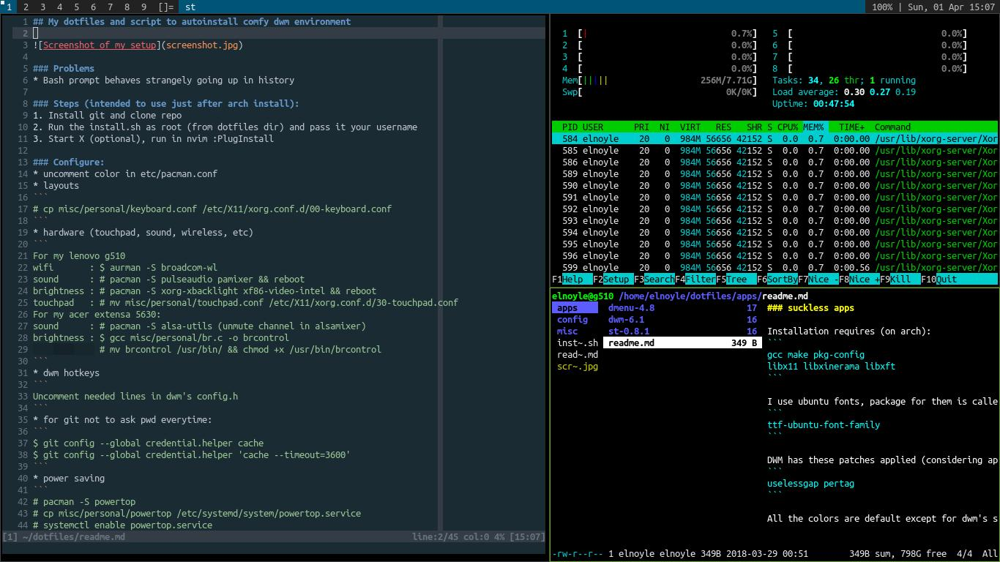

## My dotfiles and script to autoinstall comfy dwm environment



### Problems
* Bash prompt behaves strangely going up in history

### Steps (intended to use just after arch install):
1. Install git and clone repo
1. Run the install.sh as root (from dotfiles dir) and pass it your username
1. Start X (optional), run in nvim :PlugInstall

### Configure:
1. uncomment color in etc/pacman.conf
1. layouts
1. hardware (touchpad, sound, wireless, etc)
```
For my lenovo g510:
wifi:       needs broadcom-wl from aur (aurman for help)
sound:      needs pulseaudio
brightness: needs xorg-xbacklight and xf86-video-intel
touchpad:   move config file to /etc/X11/xorg.conf.d/30-touchpad.conf
```
1. dwm hotkeys
1. for git not to ask pwd everytime:
```
git config --global credential.helper cache
git config --global credential.helper 'cache --timeout=3600'
```
